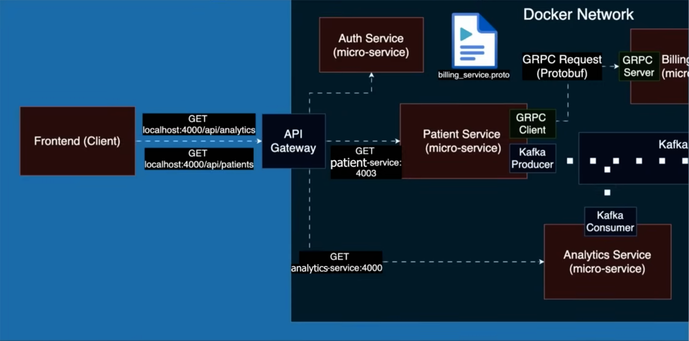

# Patient_Management_System

# Patient Management Microservices System

This repository showcases a microservices-based architecture for a **Patient Management System** using Spring Boot, Kafka, gRPC, and Docker.

## 🧠 Overview

The system is composed of the following microservices:

- **Frontend (Client)**: User-facing application interacting with backend APIs via the API Gateway.
- **API Gateway**: Routes incoming HTTP requests to appropriate microservices (Patients, Analytics).
- **Auth Service**: Handles authentication and token management.
- **Patient Service**: Core service to manage patients (CRUD operations), acts as a gRPC client to Billing Service, and produces Kafka events.
- **Billing Service**: gRPC server responsible for creating billing accounts upon patient creation.
- **Analytics Service**: Kafka consumer service that listens to patient events and performs analytics.

## 🔧 Technologies Used

- **Spring Boot**
- **Apache Kafka**
- **gRPC (Protocol Buffers)**
- **Docker & Docker Compose**
- **Kafka Template & Listener**
- **Kafka Protobuf Serialization**
- **Lombok**
- **Microservice Communication: REST, gRPC, Kafka**

---

## 🗂️ Architecture Diagram



---

## 📦 API Endpoints

### From Frontend → API Gateway:

| Endpoint                        | Method | Description                      |
|---------------------------------|--------|----------------------------------|
| `/api/patients`                | `GET`  | Fetch all patients               |
| `/api/analytics`               | `GET`  | Fetch analytics data             |

---

### Internal Service Communication

- **Patient Service → Billing Service**: Uses gRPC protocol (`billing_service.proto`) to request billing account creation.
- **Patient Service → Kafka**: Publishes `PatientCreatedEvent` to the `patient` topic.
- **Analytics Service → Kafka**: Consumes messages from the `patient` topic to generate analytics.

---

## 📍Ports & Routing

| Service            | Port  | Purpose                        |
|--------------------|-------|--------------------------------|
| API Gateway        | 4000  | Entry point to backend APIs    |
| Patient Service    | 4003  | Manages patient data           |
| Analytics Service  | 4000  | Consumes patient events        |
| Billing Service    | 9001  | gRPC Server                    |
| Kafka Broker       | 9092  | Messaging queue                |

---

## ▶️ Run Locally with Docker Compose

```bash
# Build all services
docker-compose up --build